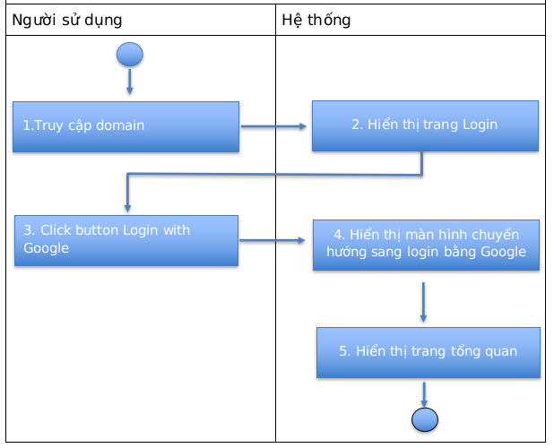

# Quy trình Login

#### Người dùng có thể thực hiện các thao tác:

* Hiển thị mật khẩu
* Lưu mật khẩu

#### Luồng quy trình

Cách 1:

.png>)

Cách 2:

Cách 3:

.png>)

#### Mô tả các bước trong quy trình

Cách 1:

.png>)

Cách 2:

.png>)

Cách 3:

.png>)

> Trường hợp người dùng không xác thực tài khoản khi đăng ký, hệ thống yêu cầu xác thực lại khi đăng nhập.
